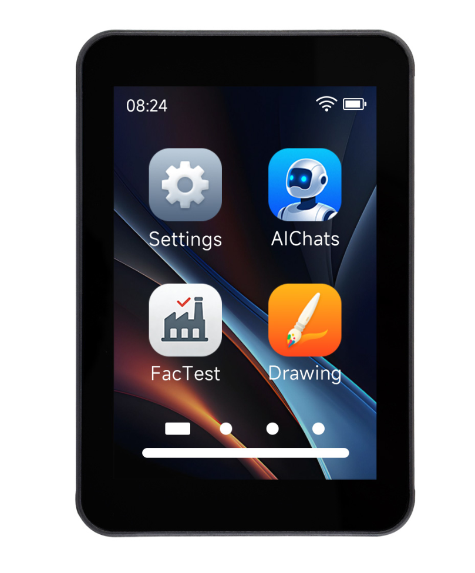

<div align="center">

# ESP32-C5-Touch-LCD-3.5

**3.5-inch ESP32-C5 Wi-Fi 6 touch display development board**

[](./LICENSE)

[中文](./README.cn.md) | English | [Product](https://www.waveshare.com/esp32-c5-touch-lcd-3.5.htm) | [Documentation](https://docs.waveshare.com/ESP32-C5-Touch-LCD-3.5) | [Firmware](./Firmware/) | [ESP-IDF Examples](./example/ESP-IDF-V554/) | [Arduino Examples](./example/Arduino-v3.3.10/example/)



</div>

## Overview

ESP32-C5-Touch-LCD-3.5 is a resource package for an ESP32-C5 based 3.5-inch touch LCD development board. The board combines a 320 x 480 touch display with camera, audio, sensor, Micro SD, battery-management, and IO-expansion resources. This repository provides Arduino examples, ESP-IDF examples, factory firmware, bundled libraries, and the hardware schematic for evaluation and application development.

This package is intended for:

- Verifying the LCD, touch, camera, audio, sensors, Micro SD card, and power-management functions.
- Building touch applications with Arduino or ESP-IDF.
- Reusing the board drivers, LVGL examples, and ESP-IDF BSP in custom projects.
- Restoring the factory demo and reviewing the board schematic.

## Hardware Overview

| Item | Description |
| :--- | :--- |
| MCU | ESP32-C5 with Wi-Fi 6 and Bluetooth LE |
| Display | 3.5-inch LCD, 320 x 480 resolution |
| LCD controller | ST7796, SPI interface |
| Touch controller | FT6336 capacitive touch controller, I2C address `0x38` |
| IO expander | CH32V006, I2C address `0x24` |
| Power management | AXP2101 PMIC, I2C address `0x34` |
| Sensors | QMI8658 6-axis IMU, PCF85063A RTC, SHTC3 temperature and humidity sensor |
| Camera | BF3901 camera sensor |
| Audio | ES8311 audio codec with microphone input and speaker output |
| Storage | Micro SD card slot |
| UI framework | Arduino examples use LVGL v8.4.0; ESP-IDF examples use LVGL v9.5.0 |
| Hardware file | [Schematic](./schematic/ESP32-C5-Touch-LCD-3.5.pdf) |

> CH32V006 is used for IO expansion and board-control functions such as LCD/touch reset, backlight control, and peripheral power control. Its control firmware is programmed at the factory. In normal use, only the ESP32-C5 application needs to be flashed.

## Supported Toolchains

| Development framework | Version | Examples |
| :--- | :--- | ---: |
| Arduino-ESP32 | `3.3.10` | 7 |
| ESP-IDF | `v5.5.4` | 8 |

## Repository Layout

```text
.
├── example/
│   ├── Arduino-v3.3.10/     # Arduino examples and bundled libraries
│   └── ESP-IDF-V554/        # ESP-IDF v5.5.4 examples
├── Firmware/                # Factory firmware
├── schematic/               # Hardware schematic
├── sdcard/                  # Reserved for Micro SD card test resources
├── LICENSE
├── README.cn.md
├── README.en.md
└── README.md
```

## Arduino Quick Start

Recommended environment:

- Arduino IDE
- `esp32 by Espressif Systems v3.3.10`
- Board selection: `ESP32C5 Dev Module`

Steps:

1. Install `esp32 by Espressif Systems v3.3.10` from Arduino IDE Boards Manager.
2. Select `ESP32C5 Dev Module` from `Tools` > `Board`.
3. Copy the required bundled libraries from `example/Arduino-v3.3.10/libraries/` to the Arduino libraries directory. The package includes `lvgl`, `SensorLib`, `XPowersLib`, and `C5_BF3901_Camera`.
4. Open an `.ino` file under `example/Arduino-v3.3.10/example/`, then build and flash it.
5. It is recommended to run `01_exio` first to verify communication with the CH32V006 IO expander before testing the display and other peripherals.

The default Arduino library directory on Windows is usually:

```text
C:\Users\<UserName>\Documents\Arduino\libraries
```

### Arduino Examples

| Example | Function |
| :--- | :--- |
| [01_exio](./example/Arduino-v3.3.10/example/01_exio/) | CH32V006 IO expander test |
| [02_I2C_qmi8658](./example/Arduino-v3.3.10/example/02_I2C_qmi8658/) | QMI8658 6-axis IMU test |
| [03_SD_Card](./example/Arduino-v3.3.10/example/03_SD_Card/) | Micro SD card read/write test |
| [04_I2C_pcf85063](./example/Arduino-v3.3.10/example/04_I2C_pcf85063/) | PCF85063A RTC test |
| [05_shtc3](./example/Arduino-v3.3.10/example/05_shtc3/) | SHTC3 temperature and humidity sensor test |
| [06_axp2101_example](./example/Arduino-v3.3.10/example/06_axp2101_example/) | AXP2101 power, battery, and interrupt status test |
| [07_lvgl_demo](./example/Arduino-v3.3.10/example/07_lvgl_demo/) | ST7796 display, FT6336 touch, backlight, and LVGL test |

## ESP-IDF Quick Start

Recommended environment:

- ESP-IDF v5.5.4
- Target chip: `esp32c5`

Enter an ESP-IDF example directory and run:

```powershell
idf.py set-target esp32c5
idf.py build flash monitor
```

### ESP-IDF Examples

| Example | Function |
| :--- | :--- |
| [01_factory](./example/ESP-IDF-V554/01_factory/) | Integrated factory demo for display, touch, camera, audio, sensors, and board resources |
| [02_lvgl_demo](./example/ESP-IDF-V554/02_lvgl_demo/) | LVGL display, touch, and benchmark demo |
| [03_sd_card](./example/ESP-IDF-V554/03_sd_card/) | Micro SD card mount and read/write verification |
| [04_qmi8658](./example/ESP-IDF-V554/04_qmi8658/) | QMI8658 accelerometer and gyroscope test |
| [05_pcf85063](./example/ESP-IDF-V554/05_pcf85063/) | PCF85063A RTC test |
| [06_shtc3](./example/ESP-IDF-V554/06_shtc3/) | SHTC3 temperature and humidity sensor test |
| [07_exio](./example/ESP-IDF-V554/07_exio/) | CH32V006 IO expander output test |
| [08_AXP2101](./example/ESP-IDF-V554/08_AXP2101/) | AXP2101 PMIC configuration and status test |

## Micro SD Card

The current Micro SD examples do not require preloaded files. Before running a test:

- Format the card as FAT32.
- Insert the card before starting the example.
- Back up important data because read/write examples may create or replace test files.

## Factory Firmware

- [Download the factory firmware](./Firmware/ESP32-C5-Touch-LCD-3.5-20260911.bin)
- Follow the verified flash address and settings in the [product documentation](https://docs.waveshare.com/ESP32-C5-Touch-LCD-3.5).

The factory firmware can be used to restore or verify the integrated board demo. Confirm the serial port, target chip, flash mode, and flash address before programming.

## Development Notes

- Start application changes in the example logic or LVGL layer. Change BSP pin definitions and power settings only when the hardware design requires it.
- The LCD and Micro SD card share SPI signals and use separate chip-select signals. Initialize and release the shared bus according to the selected example.
- Initialize the CH32V006 before using LCD reset, touch reset, backlight, or board-controlled power functions.
- The AXP2101 controls multiple board power rails. Do not disable a rail unless its load and startup dependency are understood.
- The factory example includes integrated camera, audio, sensor, display, touch, and Micro SD functionality; use the smaller examples for isolated peripheral verification.

## License

This repository is licensed under the Apache License 2.0. See [LICENSE](./LICENSE).

Bundled third-party libraries and components retain their respective license terms. Refer to the license files included in their directories.

## Support

For product setup, development instructions, and troubleshooting, visit the [Waveshare documentation](https://docs.waveshare.com/ESP32-C5-Touch-LCD-3.5). When reporting an issue, include the example path, framework version, reproduction steps, and complete serial log.

- [Open an issue](https://github.com/waveshareteam/ESP32-C5-Touch-LCD-3.5/issues/new)
- [Waveshare support](https://www.waveshare.com/contact_us)
